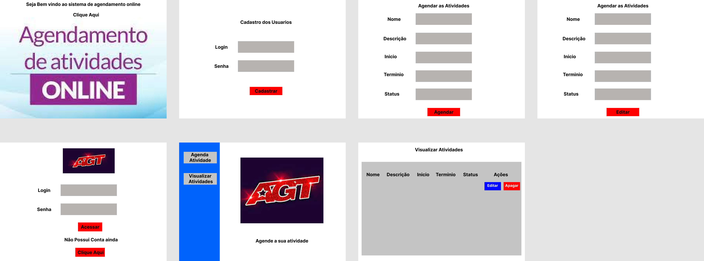

<h1 align = "center">

 AGT - Agendamento de Atividades

<h1>

## Sobre o Projeto 

O projeto **AGT** é um site de apresentação de agendamento de Atividades, onde os usuarios vão realizar qualquer compromisso com suas proprias tarefas e registrar 
quais foram concluidas durante a sua jornada do Mês, Ano e Dia.  

## Tecnologias Utilizadas 

O projeto foi desenvolvido com as seguintes tecnologias: 

- [HTML](https://developer.mozilla.org/pt-BR/docs/Web/HTML) 

- [CSS](https://developer.mozilla.org/pt-BR/docs/Web/CSS) 

- [bootstrap 4.0](https://getbootstrap.com/) 

- [PHP-7.4](https://www.php.net/) 

- [Xampp-3.3.0](https://www.apachefriends.org/pt_br/download.html); 

- [MySQL-8.0](https://www.mysql.com/)

- [PHP_MY_ADMIN-5.1.13](https://www.phpmyadmin.net/)

   
# Principais resultados obtidos 
   
Evolução no conhecimento da linguagem de marcação do html css e na linguagem de programação php. O sistema foi baseado em interfaces simples que pudesse atender toda a requisição das informações do banco de dados para as telas, onde o usuario verifica as suas principais atividades cadastradas, realizadas, com pendências e etc. 

Nesse sistema construir a relação do banco de dados da Agt com as tabelas usuario e atividade, onde a tabela atividade faz referência com os usuários, para que cada usuário possa agendar mais de uma atividade no sistema, para identificar o usuário logado e registrar o tipo de usuário que fez o agendamento, foi feito uma Session para o atributo id_usuario para realizar essa ação. 

Toda a execução do Back - end foi de forma orientada a objeto, fazendo uma arquitera MVC - Model View Controller, para identificar bem as classes, métodos e atributos do sistema e organização dos arquivos php, html, css, bootstrap e Mysql. 

Não foi feita no sistema ações complexas, foi tudo com base de forma simples e intuitiva para o usuário pode usar sem complicações. 

A forma de escolher a data das atividades com inicio e fim, ficou através do campo de preenchimento nos campos dos inputs, onde o usuário vai digitar normalmente o dado e agendar no sistema. 

Para a construção desse sistema foi feito primeiro toda uma modelagem de dados no programa BR-Modelo e depois a construção dos prototipos de tela para cadenciar melhor a questão dos tratamentos de dados, vindas do banco de dados e a realização do caminho do sistema para ter ênfase no que precisa ser construidos nas partes Front - End, Back - end e ações de trânsições de telas. 

## Como baixar o Projeto

```bash 

    # Clonar o repositório 

    $ git clone 

    $ Abrir o editor de texto Vscode, Notepad ++, Sublime Text

    $ importar o projeto para os editores de texto

    $ Entrar na Pasta Dao/database/Data_Base - AGT_Agenda.sql

    $ possui o Xampp instalado na maquina 

    $ inicializar o Apache e o Mysql 

    $ escrever localhost/phpmyadmin na barra de endereço em qualquer Navegador 

    $ Entrar na barra Sql e copiar e colar todo o banco de dados na Janela Branca da Barra Sql 

    $ escrever localhost/apresentacao_agt.php para começar a navegar no sistema 

```

## Apresentação do Projeto - AGT

** Protótipo AGT ** 



---
---
Desenvolvido por Gustavo Henrique de Souza Silva
